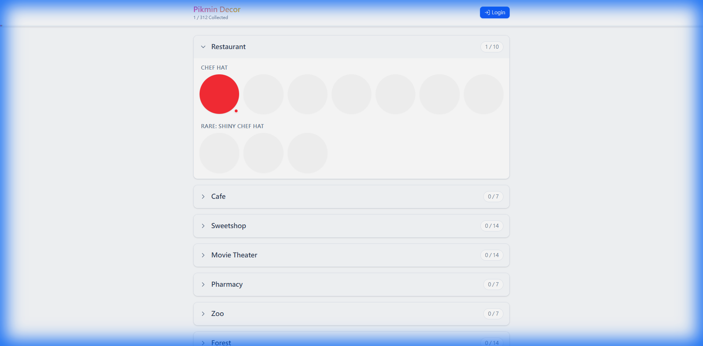

# Pikmin Bloom Decor Tracker

A beautiful, mobile-responsive web application for tracking your Pikmin Bloom decor collection. Built with React, Vite, and Tailwind CSS.



## Features

- **Comprehensive Tracking**: Track status for all Decor categories including Restaurant, Roadside, and special Events (2024/2025).
- **4-Stage Status System**:
  - 🌑 **Not Encountered** (Gray)
  - 🌱 **Seedling** (Green with Sprout Icon)
  - ❤️ **Growing** (Pink with Heart Icon)
  - ✅ **Collected** (Full Color)
- **Google Sheets Sync**: Seamlessly save and load your collection progress to your personal Google Sheet (100% free database).
- **Responsive Design**: Optimized for both mobile and desktop use.
- **Premium UI**: Clean aesthetics with smooth animations and clear progress indicators.

## Tech Stack

- **Framework**: React 19 + Vite
- **Styling**: Tailwind CSS v4
- **Icons**: Lucide React
- **Auth & Storage**: Google OAuth 2.0 + Google Sheets API

## Getting Started

### Prerequisites
- Node.js (v18 or higher)
- A Google Cloud Project with **Sheets API** and **Drive API** enabled.

### Installation

1. Clone the repository:
   ```bash
   git clone https://github.com/maggie62755/Pikmin-Bloom-Decor-Tracker.git
   cd Pikmin-Bloom-Decor-Tracker/pikmin-decor-tracker
   ```

2. Install dependencies:
   ```bash
   npm install
   ```

3. Create a `.env` file in the root directory with your Google Credentials:
   ```env
   VITE_GOOGLE_CLIENT_ID=your_client_id.apps.googleusercontent.com
   VITE_GOOGLE_API_KEY=your_api_key
   ```
   *Note: Ensure your Google Cloud OAuth consent screen includes the necessary scopes.*

### Running Locally

```bash
npm run dev
```
The app will start at `http://localhost:3000`.

## Google Sheets Sync Setup

To use the sync feature:
1. Click **Login** in the app.
2. Grant the requested permissions (Drive & Sheets).
3. Click **Save** to create/update a spreadsheet named `PikminBloomTracker` in your Google Drive.
4. Click **Load** to restore your progress on another device.

## License

This project is for personal use and fan appreciation. Pikmin is a trademark of Nintendo.
